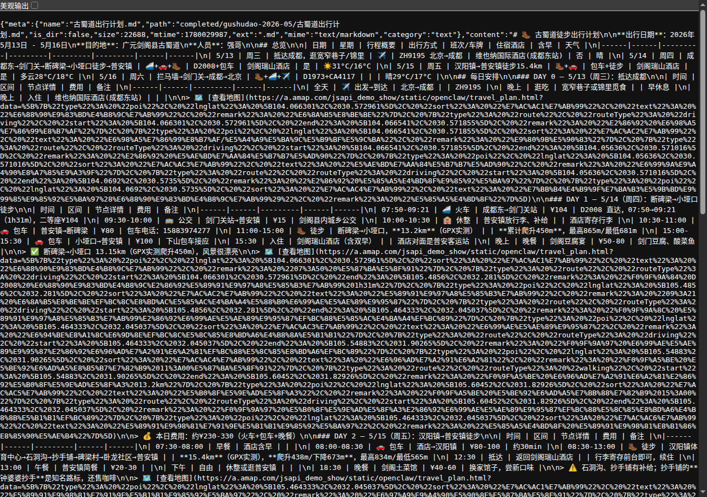
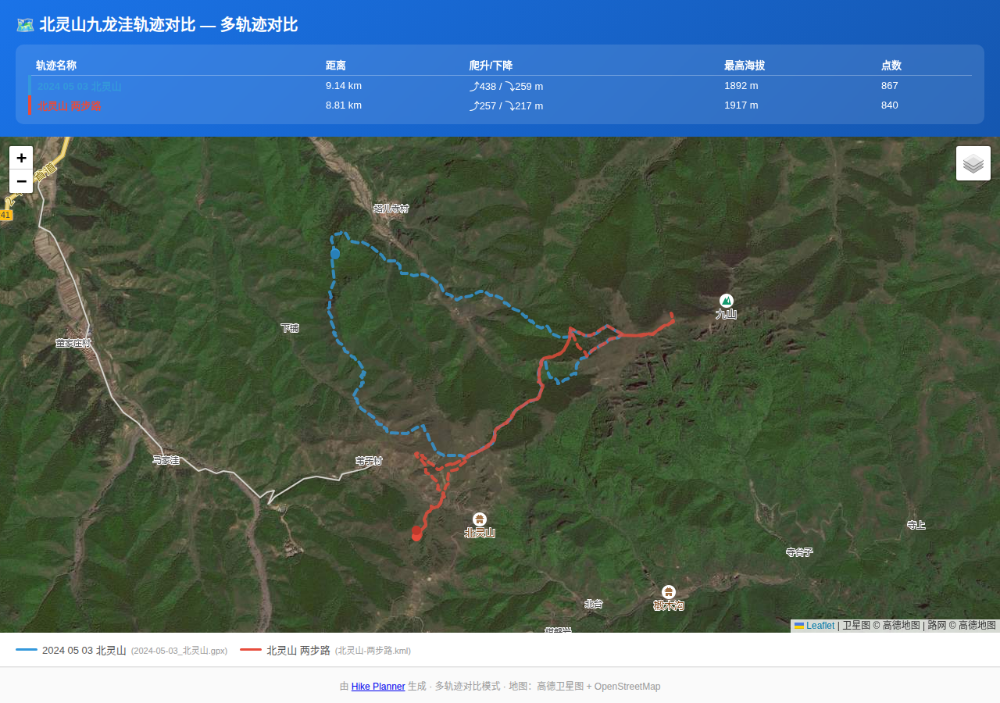
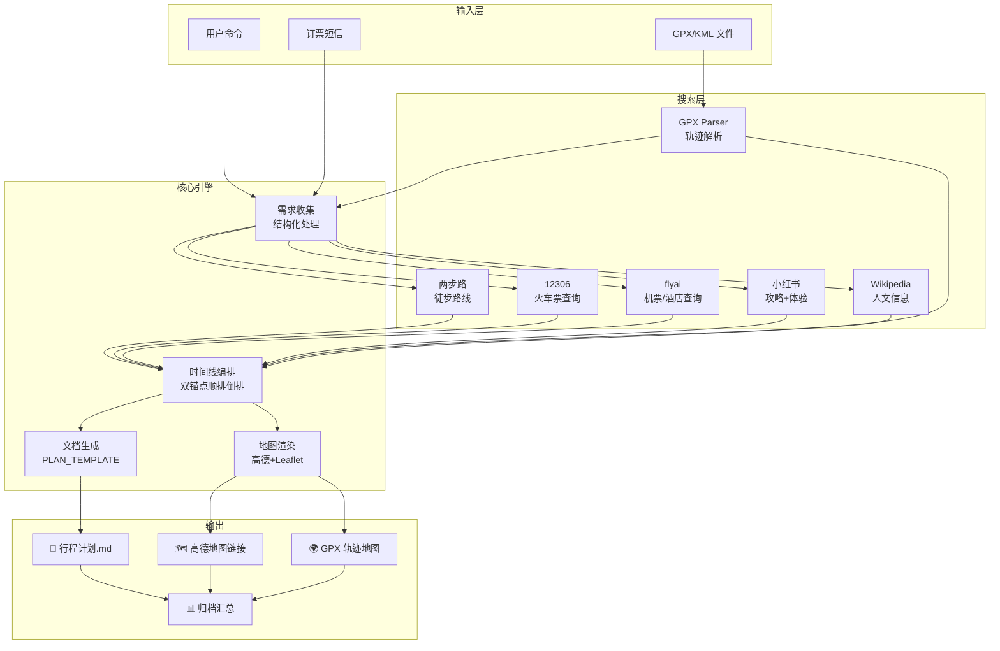
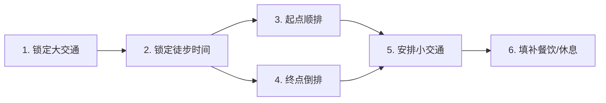

# 🥾 Hike Planner

> **一站式徒步出行规划 Skill** — 输入目的地和日期，10 分钟内生成包含交通、酒店、徒步路线、人文介绍、装备清单、轨迹地图的完整出行计划。

[](#)
[](https://clawhub.ai/updatedb/hike-planner)
[](LICENSE)

---

## 📸 效果预览

### 行程计划总览



> 包含总览表、每日时间线、徒步路线详情、人文介绍、装备清单、待办事项的完整体出行计划。

### GPX/KML 轨迹地图



> 支持多 GPX/KML 文件同图对比，交互式 Leaflet 地图可缩放、拖拽，自动渲染徒步轨迹。

---

## 🎯 解决了什么困难？

规划一次徒步出行，你通常需要在 **5+ 个平台**之间来回跳转：

| 平台 | 用途 | 痛点 |
|------|------|------|
| 12306/航司 | 查火车票/机票 | 只看票，不管路线衔接 |
| 携程/飞猪 | 订酒店 | 不知离徒步起点的距离 |
| 两步路/六只脚 | 找徒步路线 | 只管路线，不管交通住宿 |
| 小红书/B站 | 看攻略 | 信息碎片化，需大量人工整理 |
| 高德/百度地图 | 看距离 | 不会告诉你线路的人文故事 |

**Hike Planner 把这一切整合起来**：一次输入，自动完成路线搜索 → 交通/酒店查询 → 时间线编排 → 人文信息收集 → 地图生成 → 完整计划文档输出。

---

## ✨ 核心能力

| 维度 | 说明 |
|------|------|
| 🚀 **一站式** | 输入日期、目的地、活动类型，自动生成完整计划 |
| 🔍 **多源可靠** | 12306 查火车票、flyai 查机票酒店、两步路查徒步路线、小红书/B站看攻略、GPX/KML 轨迹实测 |
| ⏱️ **精准衔接** | 大交通时间 + 徒步路线时间为双锚点，顺排倒排确保节点无冲突 |
| 🗺️ **可视化** | 每日行程自动生成高德地图链接 + GPX/KML 轨迹交互式地图（Leaflet） |
| 📚 **有料** | 人文信息按目的地特性自动分类检索：地理/历史/诗词/遗存/美食，与徒步路段强关联 |
| 🎒 **装备清单** | 按目的地、季节、活动强度自动生成装备清单 + 待办事项 |

---

## 🚀 快速开始

### 安装

```bash
# 通过 ClawHub 安装（推荐）
npx clawhub install hike-planner
```

### 必备环境变量

```bash
# 高德地图 API Key（用于地图渲染 + 地理编码）
export AMAP_WEBSERVICE_KEY="your_amap_key"
```

[申请高德 API Key](https://lbs.amap.com/api/webservice/create-project-and-key)（免费，个人开发者可用）

### 第一步：查询目的地

```text
hike 四姑娘山 徒步
```

> 纯查询模式，不创建行程。返回目的地文化介绍 + 经典徒步路线详情。

### 第二步：启动规划

```text
hike-init 2026-06-01 北灵山 徒步
```

Agent 会交互式收集你的需求（出发地、返回日期、GPX 文件等），然后自动：
1. 搜索徒步路线（两步路 + 小红书 + B站）
2. 查询大交通（12306/flyai）
3. 查询酒店（flyai）
4. 收集人文信息（Wikipedia + 小红书）
5. 生成完整计划文档
6. 渲染行程地图 + GPX 轨迹地图

### 第三步：行中使用

```text
hike-today          # 查看今天计划（时间线 + 地图）
hike-log            # 记录车票/酒店/支出
todo 1 done         # 标记待办完成
```

---

## 📋 完整命令

| 命令 | 说明 |
|------|------|
| `hike [目的地] [活动?]` | 纯查询：目的地介绍 + 经典路线（不创建行程） |
| `hike-init [日期] [目的地] [活动]` | 启动规划 |
| `hike-list` | 列出未完成行程；`hike-list <tripId>` 归档汇总 |
| `hike-select <行程名>` | 激活/选择行程进行管理 |
| `hike-select output <路径>` | 设置默认输出目录 |
| `hike-select baseurl <URL>` | 设置 Web 基础 URL（默认 http://localhost） |
| `hike-status` | 查看当前行程状态与概览 |
| `hike-today` | 查看今日计划（时间线 + 地图） |
| `hike-log [内容]` | 记录车票/酒店/支出，短信自动解析 |
| `hike-add [dayN] [路线A-B]` | 添加行程段到 DayN，后续自动推后 |
| `hike-del [dayN]` | ⚠️ 删除 DayN 日程，不可撤销 |
| `hike-reorder [dayN] after\|before\|to [dayM]` | Day 级重排 |
| `todo [N] done` | 标记待办完成 |

---

## 🏗️ 架构概览



### 时间线编排逻辑



---

## 📂 输出目录结构

```
{输出目录}/
├── upcoming/
│   └── <目的地>-<YYYY-MM>/
│       ├── <目的地>出行计划.md    # 完整行程计划
│       └── gpx/                    # GPX/KML 轨迹 + 渲染HTML
│           ├── track.gpx
│           └── track_comparison.html
├── completed/
│   └── <目的地>-<YYYY-MM>/
│       └── <目的地>出行计划.md    # 归档（含实际 vs 计划对比）
└── PLAN_TEMPLATE.md               # 模板参考
```

---

## 📊 输出示例

### 总览表

| 日期 | 星期 | 行程概要 | 出行方式 | 班次/车牌 | 住宿酒店 | 含早 | 天气 |
|------|------|---------|---------|---------|---------|------|------|
| 5/13 | 周三 | 抵达成都，逛宽窄巷子/锦里 | ✈️ | CA4117 北京→成都 | 维也纳国际酒店(成都东站) | 否 | 晴 |
| 5/14 | 周四 | 成都东→剑门关→小娅子徒步→普安镇 | 🚄+🚗+🥾 | D2008+包车 | 剑阁瑞山酒店 | 是 | ☀️31°C/16°C |
| 5/15 | 周五 | 汉阳镇→普安镇徒步10km | 🥾+🚗 | 包车+徒步 | 剑阁瑞山酒店 | 是 | 多云28°C/18°C |
| 5/16 | 周六 | 拦马墙→剑门关→成都→北京 | 🥾+🚄+✈️ | D1973+CA4117 | — | — | 晴29°C/17°C |

### 每日时间线

```
DAY 2 — 5/14（周四）：小娅子→断碑梁徒步

07:50-09:21  🚄 D2008     成都东→剑门关站    ¥104    二等座，1h31m
09:21-09:35  🚗 包车      剑门关站→小娅子    ¥50     约15min
09:35-13:00  🥾 徒步      小娅子→断碑梁       —       12.7km，爬升350m
13:00-14:00  🍜 午餐      断碑梁农家乐        ¥30-40  农家菜
14:00-14:30  🚗 包车      断碑梁→普安镇       ¥30     约20min
14:30         🏨 入住      剑阁瑞山酒店         ¥200    含双早
15:00-18:00  🏛️ 观光      普安古镇+剑州古城    —       古城漫步

🗺️ [查看地图](https://a.amap.com/...)
💰 本日费用：约¥420-440
```

### 徒步路线详情

| 项目 | 数据 |
|------|------|
| 距离 | 12.7km |
| 爬升 | 350m |
| 下降 | 490m |
| 最高海拔 | 697m |
| 预计用时 | 3-4 小时 |
| 路线类型 | 山野古道 + 乡村公路 |
| 路线分类 | 穿越 |
| 关键节点 | 小娅子 → 石洞沟 → 断碑梁 |
| GPX 来源 | 两步路轨迹 + 用户上传 GPS 实测 |
| ⚠️ 提示 | 青石板路段雨后湿滑，建议穿防滑登山鞋 |

---

## 🔌 可选依赖

以下 Skill 为可选依赖，`hike-init` 启动时自动检测，缺失时提示安装：

| 依赖 | 用途 | 安装 |
|------|------|------|
| `12306-train-assistant` | 火车票余票/时刻/票价查询 | `npx clawhub install 12306-train-assistant` |
| `amap-lbs-skill` | 距离/路线/地图渲染 | `npx clawhub install amap-lbs-skill` |
| `flyai` | 机票/酒店查询 | `npx clawhub install flyai` |
| `xiaohongshu` | 小红书攻略搜索 | `npx clawhub install xiaohongshu` |

> 💡 所有外部依赖均有保底方案：不可用时自动降级为手动输入或 web_search，流程不中断。

---

## 🛡️ 隐私与安全

- **只查不买**：不执行订票、下单、候补、支付
- **文件写入需同意**：首次使用需确认输出目录；编辑命令（hike-add/del/reorder）自动写入，用户命令触发即视为同意
- **短信隐私**：hike-log 解析短信时弹窗确认，仅提取订单关键字段（车次/航班/站点/日期），不保留原始短信全文
- **网络传输声明**：行程站点名称发送给高德 API 用于地理编码和地图渲染；人文搜索将最小必要查询词发送给 Wikipedia/小红书/web_search

详见 `hike-planner/SKILL.md` 中的权限声明。

---

## 🔄 版本历史

最近 5 个版本：

| 版本 | 日期 | 关键变更 |
|------|------|---------|
| v3.3.4 | 2026-05-29 | GPX 爬升阈值 3m→0.5m + 坐标精度压缩 + 大文件采样 |
| v3.3.3 | 2026-05-29 | 轨迹 HTML flex 布局修复 openmedia 预览显示不全 |
| v3.3.0 | 2026-05-29 | webBaseUrl 配置迁移 + 中文 keywords |
| v3.2.0 | 2026-05-29 | config 迁移到 skill 目录 + 隐私声明修正 |
| v3.1.0 | 2026-05-29 | 徒步路线地图虚线渲染 + GPX 轨迹虚线 |

完整版本历史见 [CLAWLIST.md](CLAWLIST.md)。

---

## 🤝 贡献

hike-planner 是一个 OpenClaw Skill 项目。欢迎通过以下方式参与：

- 🐛 报告问题：[Issues](https://github.com/updatedb/hike-planner/issues)
- 💡 功能建议：[Issues](https://github.com/updatedb/hike-planner/issues)
- 🔧 代码贡献：Fork + PR

---

## 📄 许可

MIT License — 详见 [LICENSE](LICENSE)（如有）。
