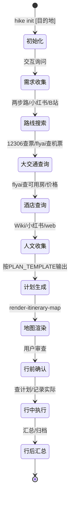

# MRD — hike-planner

**版本**: v3.3
**日期**: 2026-05-29
**类型**: 产品方案 MRD（偏功能诉求）

> ⚠️ **能力边界**：hike-planner 负责**查询与规划**，**不执行订票、下单、候补、支付**。
> 查询火车票/机票/酒店（余票/价格/可订房）是 P0 必需；购买不在范围内。

---

## 1. 问题定义

### 1.1 要解决的问题

普通旅行者规划一次徒步出行，面临三个断层：

1. **信息断层**：大交通（火车/机票）、酒店、徒步路线、人文背景分散在不同平台，需要反复跳转搜索、拼接信息
2. **规划断层**：手动协调交通时间 + 酒店入住 + 徒步耗时 + 体能消耗，容易遗漏或衔接失误
3. **执行断层**：出发后计划与实际偏差（费用超支、时间延误、路线变更），缺少统一的记录和汇总机制

### 1.2 约束条件

- 面向普通旅行者（非专业徒步），操作门槛低
- 整合内置路线搜索（两步路轨迹搜索 + 高德地图渲染 + GPX/KML 解析）
- 依赖外部数据源（12306/高德/flyai/小红书），网络可能受限
- 以 OpenClaw Skill 形态交付，遵循 ClawHub 发布规范

### 1.3 成功标准

- 用户输入目的地 + 日期 + 偏好 → 10 分钟内生成完整出行计划
- 计划覆盖：大交通查询 + 酒店查询 + 徒步路线 + 人文介绍 + 装备清单 + GPX/KML 轨迹地图
- 徒步路线精度由 GPX/KML 轨迹实测保证（非估算）

---

## 2. 目标市场

### 2.1 用户画像

| 维度 | 描述 |
|------|------|
| **身份** | 普通旅行者（非专业徒步），有徒步兴趣但不想自己研究路线 |
| **年龄** | 25-50 岁，会用 AI 工具 |
| **场景** | 周末/短假徒步，国内目的地为主 |
| **痛点** | "想去徒步但不知道去哪、怎么去、路上有什么可看的" |
| **技术能力** | 能使用 OpenClaw 等 AI 助手 |

### 2.2 使用场景

---

## 3. 竞品分析

### 3.1 现有替代方案

| 方案 | 优点 | 缺点 |
|------|------|------|
| **手动拼凑**（12306+携程+两步路+小红书+百度百科） | 信息全，可控 | 耗时 2-4 小时，格式不统一
| **AI 通用问答**（ChatGPT/Claude 直接问） | 快速 | 无实时数据，信息幻觉
| **两步路/六只脚** | 徒步路线丰富 | 只管路线，不管交通/酒店/人文
| **马蜂窝/穷游行程助手** | 有行程模板 | 偏城市游，徒步深度不足
| **ClawHub 现有 Skill** | 单一功能可用 | 无全链路覆盖 |

### 3.2 ClawHub 同类 Skill 对比

> 数据来源：`skill-hub-search.py --live`，2026-05-19，ClawHub 注册 Skill 2999 个 | 已安装 89 个

| Skill | 评分 | 徒步 | 交通 | 酒店 | 人文 | 地图 | 行中 | 行后 |
|-------|------|------|------|------|------|------|------|------|
| hike-route-planner | 2.95 | ⚠️ | ❌ | ❌ | ❌ | ❌ | ❌ | ❌ |
| travel-itinerary-planner | 3.04 | ❌ | ❌ | ❌ | ❌ | ❌ | ❌ | ❌ |
| camino-travel-planner | 3.06 | ⚠️ | ❌ | ❌ | ❌ | ❌ | ❌ | ❌ |
| **hike-planner** | — | ✅ 两步路+GPX | ✅ 12306 | ✅ flyai | ✅ Wiki+🍠 | ✅ 高德+虚线 | ✅ | ✅ |

**关键发现**：
- ClawHub 上**唯一**徒步相关 Skill `hike-route-planner` 评分仅 2.95，功能极简
- 现有旅行类 Skill **全部**是单一功能（要么只查交通、要么只做路线），没有一个覆盖「路线+交通+酒店+人文+地图+记录+汇总」全链路
- 没有任何 ClawHub Skill 接入 12306 / 两步路 / 高德 等真实数据源

### 3.3 差异化定位

| 维度 | ClawHub 同类 | hike-planner |
|------|-------------|-------------|
| 一站式徒步 | ❌ 全无 | ✅ 路线+交通+酒店+人文 |
| 实时数据 | ❌ 全无 | ✅ 12306/flyai/两步路 |
| GPX/KML 轨迹 | ❌ 全无 | ✅ 解析+渲染+多文件对比 |
| 人文深度 | ⚠️ china-travel | ✅ 诗词/历史/遗存+12分类 |
| 地图渲染 | ⚠️ amap-walk-route | ✅ 高德全景+GPX轨迹+虚线徒步 |
| 行中执行闭环 | ❌ 全无 | ✅ 查计划/记录/汇总 |
| 保底策略 | ❌ | ✅ 依赖不可用→人工确认 |

---

## 4. 用户需求

### 4.1 需求优先级（MoSCoW）

| 优先级 | 需求 | 状态 |
|--------|------|------|
| **P0 必须有** | 交互式收集旅行需求 | ✅ 已实现 |
| **P0 必须有** | 徒步路线搜索（两步路+小红书+B站） | ✅ 已实现 |
| **P0 必须有** | 查询火车票余票/价格/时刻 | ✅ 已实现 (12306-train-assistant) |
| **P0 必须有** | 查询机票/酒店可用/价格 | ✅ 已实现 (flyai) |
| **P0 必须有** | 生成完整计划（交通+酒店+路线+人文） | ✅ 已实现 |
| **P0 必须有** | 对外部依赖有保底方案 | ✅ 已实现 |
| **P0 必须有** | 行程地图渲染（高德+GPX轨迹+虚线徒步） | ✅ 已实现 |
| **P1 应该有** | GPX/KML 轨迹解析+渲染 | ✅ 已实现 |
| **P1 应该有** | KML 多文件对比渲染 | ✅ 已实现 |
| **P1 应该有** | 行中查询每日计划 | ✅ 已实现 |
| **P1 应该有** | 行中记录实际数据 | ✅ 已实现 |
| **P1 应该有** | 行后汇总输出 | ✅ 已实现 |
| **P2 可以有** | 徒步路线虚线渲染 | ✅ 已实现 |
| **P2 可以有** | 多日行程徒步节点合并展示 | ✅ 已实现 |
| **P2 可以有** | 海外行程费用人民币换算 | ✅ 已实现 |
| **P2 可以有** | 轨迹 HTML flex 布局（openmedia 兼容） | ✅ 已实现 |
| ❌ 不做 | 自动订票/订酒店/下单支付 | 不执行订票、下单等操作 |

### 4.2 使用场景流程

---

## 5. 商业价值

### 5.1 ClawHub 生态价值

- 填补 ClawHub 上「旅行规划」类 Skill 的空白
- demo 价值：展示 OpenClaw Agent 如何协调多个外部数据源
- 可复用模式：为其他 Skill（如地铁规划、骑行规划）提供参考

### 5.2 用户价值

- 时间节省：从 2-4 小时手动拼凑 → 10 分钟内 AI 生成
- 质量提升：结构化输出（PLAN_TEMPLATE），信息有据可查
- 体验闭环：规划→执行→汇总三阶段，不是一次性用完就扔

---

## 6. 市场策略

### 6.1 发布策略

- 发布到 ClawHub，版本号 0.1.0
- 初始用户：强哥自用验证 → 内部测试通过后再公开发布

### 6.2 推广路径

- 依赖 ClawHub 自然发现
- 如有徒步相关社区/群聊，可作为 demo 展示

---

## 7. 风险与假设

| # | 风险/假设 | 缓解措施 |
|---|----------|---------|
| 1 | 12306-train-assistant 不可用 | 手动输入车次 |
| 2 | flyai 搜索结果不稳定 | web_search 兜底 |
| 3 | 小红书登录态过期 | web_search + Wikipedia 替代 |
| 4 | 两步路网站不可达 | browser 直接打开 + web_search 搜其他网站 |
| 5 | AMAP_WEBSERVICE_KEY 未设置 | 跳过地图渲染，纯文字输出 |
| 6 | GPX/KML 坐标精度低 | 取原始轨迹为真理之源，不依赖估算 |

---

## 8. Skill 能力边界

### 8.1 内置能力（hike-planner 核心，无需外部依赖）

| 能力 | 说明 |
|------|------|
| 徒步路线搜索 | 两步路GPS轨迹 + 小红书攻略 + B站视频 |
| GPX/KML 轨迹解析 | gpx-parser.py / kml-parser.py 提取坐标+距离+爬升 |
| 轨迹地图 HTML 渲染 | generate-track-map.py 生成 Leaflet 交互式地图 + 多文件对比 |
| 行程地图渲染 | render-itinerary-map.js 高德导航链接（多路线类型+虚线徒步） |
| 人文信息收集 | Wikipedia + web_search + xiaohongshu 12 类别 |
| 行程计划生成 | renderPlan 按 PLAN_TEMPLATE 格式输出 |
| 行中记录/行后汇总 | cmdLog + cmdStatus + compareActualVsPlan + 归档 |

### 8.2 外部依赖（可选，不可用时保底）

| 依赖 | 能力 | 保底方案 |
|------|------|---------|
| `12306-train-assistant` | 火车票余票/价格/时刻查询 | 手动输入车次信息 |
| `amap-lbs-skill` | 距离/路线规划/地理编码 | 手动输入坐标/距离 |
| `flyai` | 机票/酒店可用与价格查询 | web_search 替代 |
| `xiaohongshu__search_feeds` | 小红书攻略搜索 | web_search 替代 |

### 8.3 明确不做

| 不做 | 原因 |
|------|------|
| 🔒 自动订火车票 | 需 12306 登录+支付，超出规划工具边界 |
| 🔒 自动订机票 | 需 flyai 下单+支付，超出范围 |
| 🔒 自动订酒店 | 需 flyai 下单+支付，超出范围 |
| 🔒 支付任何费用 | 不在规划工具职责范围内 |
