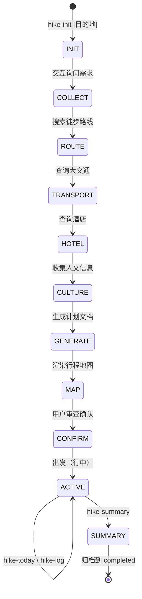
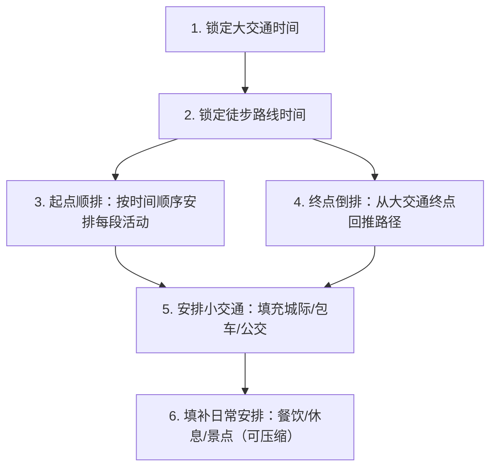

# PRD — hike-planner

**版本**: v0.3
**日期**: 2026-05-19
**依赖**: MRD v0.3 | [MRD.md](./MRD.md)

---

## 1. 产品概述

### 1.1 产品定位

hike-planner 是一个 OpenClaw Skill，为普通旅行者提供一站式徒步出行规划：从路线搜索、交通/酒店查询、人文信息收集，到计划生成、行中记录、行后汇总，覆盖规划→执行→收尾全链路。

### 1.2 一句话描述

输入目的地和日期，10 分钟内生成一份包含大交通、酒店、徒步路线、人文介绍、装备清单的完整体出行计划。

### 1.3 核心原则

| 原则 | 说明 |
|------|------|
| **只查不买** | 查询火车票/机票/酒店余量与价格，不负责下单支付 |
| **有据可查** | 所有信息标注来源（12306/两步路/Wikipedia/小红书） |
| **依赖保底** | 外部依赖不可用时自动降级为手动输入，不中断流程 |
| **标准 Skill** | 遵循 OpenClaw Skill 规范，可发布到 ClawHub |

---

## 2. 用户流程

### 2.1 主命令设计

```
hike-init [日期] [目的地] [活动]  — 启动规划流程
hike-list                          — 列出未完成行程；hike-list <tripId> 归档并汇总
hike-select <行程名>               — 激活/选择行程
hike-select output <路径>          — 设置默认输出目录
hike-status                        — 查看当前行程状态与概览
hike-today                         — 查看今日计划（时间线 + 地图）
hike-log [内容]                    — 记录车票/酒店/支出，短信自动解析修订
hike-add [dayN] [路线A-B]          — 添加行程段到 DayN，后续行程自动推后
hike-del [dayN]                    — 删除 DayN 整个日程，后续日程自动移前
hike-reorder [dayN] after|before|to [dayM]  — Day 级重排
```

### 2.2 完整流程



### 2.3 交互示例

```
👤 用户: hike-init 古蜀道

🤖 hike-planner:
  好的！先确认几个信息：
  1. 出发日期和返回日期？
  2. 从哪里出发？回到哪里？
  3. 几个人？有什么偏好？
  4. 计划输出到哪个目录？（默认 ~/travel/trip/）

👤 用户: 5月13日出发，5月16日回。从北京出发，回北京。1个人，喜欢历史文化。输出到默认目录。

🤖 hike-planner:
  收到。开始搜索古蜀道徒步路线...
  [两步路] 找到 3 条轨迹，最推荐：小娅子→断碑梁 12.7km
  [小红书] 攻略补充：青石板古道，古柏参天
  [12306] 北京→成都 机票/火车票查询...
  [flyai] 剑门关附近酒店查询...
  
  计划已生成，请看：
  📄 ~/travel/trip/upcoming/gushudao-2026-05/README.md
  🗺️ [查看地图](https://a.amap.com/...)
```

---

## 3. 功能需求

### 3.1 阶段一：行前规划（P0）

#### 3.1.1 需求收集

| 功能 | 输入 | 输出 |
|------|------|------|
| 交互式询问 | 目的地、日期、出发地、人数、偏好 | 结构化需求对象 |

**询问模板**：
1. 出发日期 + 返回日期（单程可不填返回）
2. 出发城市 + 返程城市
3. 人员数量
4. 偏好（交通方式/住宿/体力/兴趣方向）
5. 输出目录（可选，默认 `~/travel/trip/`）

#### 3.1.2 徒步路线搜索（内置 route-search）

| 数据源 | 方法 | 提取内容 |
|--------|------|---------|
| 两步路 (2bulu.com) | `web_search: site:2bulu.com <目的地> 徒步 轨迹` | GPS轨迹、距离、爬升、海拔、轨迹点 |
| 小红书 | `xiaohongshu__search_feeds` | 图文攻略、照片、避坑、补给点 |
| Bilibili | `web_search: site:bilibili.com <目的地> 徒步` | 视频攻略、路线实拍 |
| YouTube | `web_search: site:youtube.com <目的地> hiking` | 视频补充（国外路线） |

**输出格式**（参考 PLAN_TEMPLATE 徒步路线详情表）：

```markdown
| 项目 | 数据 |
|------|------|
| 距离 | XXkm |
| 爬升 | XXXm |
| 下降 | XXXm |
| 最高海拔 | XXXXm |
| 预计用时 | X-X小时 |
| 路线类型 | 古道 / 山野 / 景区栈道 / 混合 |
| 关键节点 | 起点→节点1→...→终点 |
| GPX来源 | 两步路 + 日期 |
| ⚠️ 提示 | 补给点 / 危险 / 注意事项 |
```

#### 3.1.3 GPX 轨迹解析（P1）

- 用户可提供 GPX 文件，解析提取：起终点坐标、总距离、累计爬升/下降、海拔曲线
- 如有 GPX，优先用 GPS 实测数据替代两步路估算
- GPX 轨迹数据覆盖高德步行估算

#### 3.1.4 大交通查询（P0）

| 交通类型 | 工具 | 查询内容 | 保底 |
|----------|------|---------|------|
| 🚄 火车票 | `12306-train-assistant` | 车次、时刻、余票、票价、经停站 | 用户手动输入 |
| ✈️ 机票 | `flyai`（优先）/ `web_search` | 航班、时刻、价格 | 用户手动输入 |

**火车票查询命令**（来自 12306-train-assistant）：
```bash
python3 ~/travel/skills/12306-train-assistant/client.py left-ticket --date YYYY-MM-DD --from 出发站 --to 到达站
python3 ~/travel/skills/12306-train-assistant/client.py route --train-code 车次 --date YYYY-MM-DD --from 出发站 --to 到达站
```

**信息格式**：
```
D2008 成都东07:50→剑门关09:21（1h31m），二等座¥104，余票充足
```

#### 3.1.5 酒店查询（P0）

| 工具 | 查询内容 | 保底 |
|------|---------|------|
| `flyai`（优先） | 酒店名称、价格、含早、可订房、位置 | web_search 搜索 |
| `web_search` | 携程/飞猪公开信息 | 用户手动输入 |

**信息格式**：
```
剑阁瑞山酒店 | ¥200-300/晚 | 含双早 | 普安客运站对面 | 有房
```

#### 3.1.6 人文信息收集（P0）

| 数据源 | 优先级 | 内容 |
|--------|--------|------|
| Wikipedia | 🥇 | 地理、历史、战争、人物、世界遗产 |
| 小红书 | 🥈 | 真实体验、补给点、当季路况、美食 |
| web_search | 🥉 | 补充信息、最新动态 |

**输出类别**（参考 PLAN_TEMPLATE，按目的地特性选择 3-5 个）：

| 类别 | 内容要求 |
|------|---------|
| 地理风貌 | 地形、气候、植被、景观特色 |
| 历史渊源 | 关键历史事件、战争、人物 |
| 人文与诗词 | 1-2 首诗词原文（准确引用）+ 作者 + 创作背景 |
| 遗存遗迹 | 古建筑、古道、关隘、石刻 |
| 美食特产 | 1-2 种当地美食 + 觅食地点 |
| 世界遗产/5A景区/宗教/民俗 | 按目的地特性选 |

**写作规范**：

| 规范 | 说明 |
|------|------|
| **篇幅** | 每类 600-1000 字 |
| **关联性** | 必须与行程路线关联。例如介绍某段古道的历史时，点名徒步路线经过的具体位置、可看到的遗存 |
| **趣味性** | 避免百科式堆砌，用故事化叙事。优先选取有趣的人物轶事、战争细节、民间传说，而非枯燥的编年史 |
| **场景感** | 让读者能想象「走到这里会看到什么、感受到什么」。例如："当你踩着被千年脚步磨得光滑的青石板，头顶是遮天蔽日的古柏……" |
| **诗与景** | 引用诗词时关联徒步路段。例如："李白笔下的'剑阁峥嵘而崔嵬'，正是你今日徒步经过的剑门关——两侧绝壁如削，仅中间一线古道可通" |
| **美食定位** | 推荐美食时指明在哪里能吃到、徒步途中哪些节点有补给、价格大致多少 |

**诗词引用规范**：
- 标题：**《诗词名》** — 作者（朝代）
- 原文：完整准确引用
- 背景：1-2 句话说明创作时间、地点
- 关联：1 句话点出诗词与徒步路段的对应关系
- 禁止捏造或修改诗词原文

#### 3.1.7 计划文档生成（P0）

按 `PLAN_TEMPLATE.md` 格式生成完整 README.md，包含：

| 章节 | 内容 |
|------|------|
| 总览表 | 日期、行程概要、出行方式、班次、酒店、天气 |
| 每日安排 | 时间线表（时间/区间/节点/费用/备注） |
| 行程详情 | 目的地人文介绍（地理/历史/诗词/遗存/美食） |
| 徒步路线详情 | 距离/爬升/节点/GPX/提示 |
| 装备清单 | 按类型分类 |
| 待办事项 | 订票/预订/购买等 |

**时间线编排规则**（参考 Travel Agent SOP）：



**步骤说明**：
1. **锁定大交通时间** — 火车/机票是固定锚点，一切围绕它展开
2. **锁定徒步路线时间** — 根据路线距离和预计用时确定徒步起止时间
3. **起点顺排** — 从出发地开始，按时间顺序安排每段小交通+活动
4. **终点倒排** — 从大交通终点回推，确保每个节点时间衔接合理
5. **安排小交通** — 城际交通、包车、公交等基于前两步的时间窗口安排
6. **填补日常安排** — 餐饮、休息、景点等填入时间空隙（可压缩部分）

**关键约束**：
- 大交通时间是锚点，一切围绕它排
- 徒步路线时间是第二锚点，时间和体能消耗不允许挤压
- 高铁候车不超 30 分钟，机场提前 1 小时
- 同一酒店多日入住不重复写退房+入住，写"续住"

#### 3.1.8 行程地图渲染（P0，内置 route-search）

使用内置的 `render-itinerary-map.sh` 脚本生成每日高德地图可视化链接。

**脚本路径**：`scripts/render-itinerary-map.sh`

**参数**：
| 参数 | 必填 | 说明 |
|------|------|------|
| stops | ✅ | 行程节点，竖线或逗号分隔 |
| city | ❌ | 城市范围（提高地理编码精度） |
| routeTypes | ❌ | 各段路线类型（walking/driving/transfer） |

**路线类型映射**：
| 交通方式 | 路线类型 |
|----------|---------|
| 🥾 徒步 | `walking` |
| 🚗 包车/出租/自驾 | `driving` |
| 🚌 公交 | `driving` |
| 🚄 火车 / ✈️ 飞机 | `driving`（高德无铁路航线，remark 标注实际方式） |

### 3.2 阶段二：行中执行（P1）

#### 3.2.1 查询每日计划

```
👤 用户: hike-today
🤖 返回当天的时间线表 + 注意事项 + 地图链接
```

#### 3.2.2 记录实际数据

```
👤 用户: hike-log 实际出发晚了30分钟，汉阳镇包车多花了20块
🤖 已记录：5/15 出发时间延迟 30min，交通费用 +¥20
```

**记录字段**：
| 字段 | 说明 |
|------|------|
| 实际时间 | 实际出发/到达时间，与计划对比 |
| 实际费用 | 实际花费，与预算对比 |
| 实际路线 | 路线变更记录 |
| 备注 | 自由文本 |

#### 3.2.3 状态管理

行程状态流转：
```
INIT → PLANNING → CONFIRMED → ACTIVE → COMPLETED
```

### 3.3 阶段三：行后汇总（P1）

#### 3.3.1 汇总输出

```
👤 用户: hike-summary
🤖 汇总报告：
  📊 总费用：¥XXX（超标/节约 ¥XX）
  ⏱️ 总耗时：XXh（计划 vs 实际偏差 Xh）
  🥾 徒步里程：XXkm（计划 vs 实际偏差 Xkm）
  💡 经验教训：[用户记录的备注汇总]
  
  已归档到：{输出目录}/completed/gushudao-2026-05/
```

#### 3.3.2 归档

- 将 `upcoming/` 目录移至 `completed/`
- 更新 README.md 补充实际数据
- 生成经验总结

---

## 4. 数据结构

### 4.1 行程计划对象

```json
{
  "tripId": "gushudao-2026-05",
  "status": "PLANNING",
  "destination": "古蜀道·金牛道（剑阁段）",
  "dates": { "start": "2026-05-13", "end": "2026-05-16" },
  "participants": 1,
  "preferences": { "transport": "火车", "interests": ["历史文化"] },
  "days": [
    {
      "date": "2026-05-14",
      "dayOfWeek": "周四",
      "theme": "小娅子→断碑梁徒步",
      "weather": { "condition": "晴", "high": 31, "low": 16 },
      "nodes": [
        {
          "time": "07:50-09:21",
          "type": "train",
          "name": "成都东→剑门关站",
          "detail": "D2008",
          "cost": 104,
          "remark": "二等座，1h31m"
        }
      ]
    }
  ],
  "hikingRoutes": [
    {
      "name": "小娅子→断碑梁",
      "distance": 12.7,
      "ascent": 350,
      "descent": 490,
      "maxAltitude": 697,
      "estimatedTime": "3-4小时",
      "type": "山野古道+乡村公路",
      "keyNodes": ["小娅子", "断碑梁"],
      "source": "两步路",
      "tips": "青石板湿滑注意防滑"
    }
  ],
  "culture": {
    "geography": "...",
    "history": "...",
    "poetry": ["《蜀道难》— 李白"],
    "relics": "...",
    "food": "剑门豆腐、酸菜"
  },
  "equipment": {
    "shoes": "防滑登山鞋",
    "clothing": "长裤×3、速干T恤×2、薄风衣",
    "bag": "30L徒步背包"
  },
  "todos": ["购买徒步干粮", "预约苏坦餐厅"],
  "totalBudget": 800,
  "mapUrls": ["https://a.amap.com/..."]
}
```

### 4.2 目录约定

输出目录可由用户在 `hike-init` 时指定，未指定则默认 `~/travel/trip/`。

```
{输出目录}/
├── upcoming/
│   └── <目的地>-<YYYY-MM>/
│       └── README.md          # 行程计划
├── completed/
│   └── <目的地>-<YYYY-MM>/
│       └── README.md          # 归档（含实际数据）
└── PLAN_TEMPLATE.md           # 模板（只读参考）
```

**示例**：
- 默认：`~/travel/trip/upcoming/gushudao-2026-05/README.md`
- 指定：`/home/user/my-trips/upcoming/gushudao-2026-05/README.md`

---

## 5. Skill 目录结构

```
hike-planner/
├── SKILL.md                    # 主文档：命令定义 + 流程说明
├── _meta.json                  # slug + version（发布用）
├── scripts/
│   ├── hike-planner.js         # 主脚本：状态管理 + 流程编排
│   ├── render-itinerary-map.sh # 高德地图渲染（来自 route-search）
│   └── render-itinerary-map.js # 高德地图 JS 版
├── references/
│   ├── PLAN_TEMPLATE.md        # 行程计划模板
│   └── travel-agent-sop.md     # SOP 参考（核心流程）
└── assets/
    └── gpx-parser.py           # GPX 轨迹解析（P1）
```

---

## 6. 外部依赖与保底策略

| 依赖 | 类型 | 调用方式 | 不可用时 |
|------|------|---------|---------|
| `12306-train-assistant` | 可选 | `python3 ~/travel/skills/12306-train-assistant/client.py` | 提示用户手动输入车次 |
| `amap-lbs-skill` | 可选 | OpenClaw Skill 调用 | 用户手动输入坐标/距离 |
| `flyai` | 可选 | `npx flyai ...` | web_search 替代 |
| `xiaohongshu__search_feeds` | 可选 | MCP 工具 | web_search + Wikipedia 替代 |
| `web_search` | 始终可用 | OpenClaw 内置 | — |
| 两步路 (2bulu.com) | 主数据源 | web_search + tavily_extract | web_search 其他徒步网站 |
| Wikipedia | 人文数据源 | web_search / wiki_search | web_search 替代 |
| 高德地图 API | 地图渲染 | `AMAP_WEBSERVICE_KEY` 环境变量 | 跳过地图，仅文字输出 |

**保底逻辑**：依赖检测 → 可用则用 → 不可用提示用户手动输入 → 继续流程，不中断。

---

## 7. 验收标准

### 7.1 功能验收

| # | 验收项 | 标准 | 对应优先级 |
|---|--------|------|-----------|
| 1 | 交互式需求收集 | 用户输入目的地+日期 → 生成结构化需求对象 | P0 |
| 2 | 徒步路线搜索 | 返回两步路GPS轨迹 + 小红书/B站攻略 | P0 |
| 3 | 火车票查询 | 返回车次/时刻/余票/价格（12306 或手动） | P0 |
| 4 | 机票/酒店查询 | 返回航班/酒店可用与价格（flyai 或手动） | P0 |
| 5 | 人文信息收集 | 输出地理/历史/诗词/遗存/美食，来源可追溯 | P0 |
| 6 | 计划文档生成 | 按 PLAN_TEMPLATE 格式输出完整 README.md | P0 |
| 7 | 地图渲染 | 每日行程生成高德地图链接 | P0 |
| 8 | 依赖保底 | 任一外部依赖不可用时提示手动输入，流程不中断 | P0 |
| 9 | GPX 解析 | 导入 GPX 文件 → 提取距离/爬升/海拔 | P1 |
| 10 | 行中查询 | `hike-today` 返回当天计划 | P1 |
| 11 | 行中记录 | `hike-log` 记录实际数据并对比 | P1 |
| 12 | 行后汇总 | `hike-summary` 输出汇总报告并归档 | P1 |

### 7.2 质量验收

| # | 验收项 | 标准 |
|---|--------|------|
| Q1 | 信息来源 | 所有事实类信息有出处（12306/两步路/Wiki/小红书链接） |
| Q2 | 诗词准确性 | 引用诗词原文一字不差，标注作者+朝代+背景 |
| Q3 | 时间合理性 | 高铁候车 ≤ 30min，机场提前 ≥ 1h，节点衔接无冲突 |
| Q4 | 保底覆盖 | 4 个外部依赖各有保底方案，任一不可用时流程继续 |
| Q5 | Skill 规范 | 通过 `skill-creator/package_skill.py` 验证 |
| Q6 | 模板一致性 | 输出与 gushudao-2026-05 README 质量对标 |
| Q7 | 人文篇幅 | 每类 600-1000 字，关联行程路线，有故事性和场景感 |

---

## 8. 异常处理

| 场景 | 处理 |
|------|------|
| 目的地搜不到徒步路线 | 提示用户，转为通用旅行规划 + 建议用户上传 GPX 文件替代路线搜索 |
| 两步路返回空结果 | web_search 搜索其他徒步网站 + 建议用户上传 GPX 文件获取精确轨迹 |
| 火车票无余票 | 列出替代车次，提示用户考虑候补或调整日期 |
| 酒店无可用房 | 扩大搜索范围或降级为 web_search/手动 |
| 小红书未登录 | 静默跳过，用 web_search + Wikipedia |
| 用户没 AMAP_WEBSERVICE_KEY | 跳过地图渲染，纯文字输出 |
| 日期/目的地信息不完整 | 交互式追问，不猜测 |
| GPX 文件格式异常 | 提示用户检查文件，跳过 GPX 解析 |

---

## 9. 技术选型

| 决策 | 选型 | 理由 |
|------|------|------|
| 主脚本语言 | Node.js (JavaScript) | 与 debate-arena 一致，ClawHub 主流 |
| 地图渲染 | Bash (render-itinerary-map.sh) | 已有成熟脚本，直接内置 |
| GPX 解析 | Python3 | gpxpy 库成熟，简洁可靠 |
| 状态存储 | JSON 文件（`~/travel/trip/` 目录） | 简单可控，与 Travel Agent 一致 |
| 模板引擎 | 字符串替换 | 场景简单，不需要模板引擎 |

---

## 10. 里程碑

| 里程碑 | 内容 | 预计 |
|--------|------|------|
| M1: Skill 骨架 | SKILL.md + 主脚本框架 + 目录结构 | Phase V 后 |
| M2: 行前规划 | 路线搜索 + 交通/酒店查询 + 计划生成 + 地图渲染 | Dev 阶段 |
| M3: 行中执行 | hike-today / hike-log + 状态管理 | Dev 阶段 |
| M4: 行后汇总 | hike-summary + 归档 | Dev 阶段 |
| M5: 测试验收 | tester 回归测试 | Test 阶段 |
| M6: ClawHub 发布 | package + publish | 验收后 |

---

## 11. 版本历史

| 版本 | 日期 | 变更 |
|------|------|------|
| v0.1.0 | 2026-05-19 | 初始发布：hike-init / hike-status / hike-today / hike-log / hike-summary 核心命令，两步路路线搜索 + 12306/flyai 交通查询 + 人文信息收集 + 行程计划生成 + 高德地图渲染 |
| v0.1.2 | 2026-05-19 | _meta.json 补充 name 字段 |
| v0.1.4 | 2026-05-19 | 外部依赖安装引导 |
| v0.2.0 | 2026-05-20 | 短信解析 + 实时修订 + 汽车/徒步区分 |
| v0.2.1 | 2026-05-20 | Backlog 修复：delayMinutes/costOverrun 链路修复 + 新模式处理 |
| v0.3.0 | 2026-05-20 | 行程详情强制完善 + 出行建议/网红推荐 + 装备/待办预填充 + 每日安排补充路线详情 + hike-add/remove/reorder 路线调整命令 |
| v0.3.1 | 2026-05-21 | 小版本发布 |
| v1.1.0 | 2026-05-21 | 命令 Day 级重写（hike-add/hike-del/hike-reorder）+ 文化分类统一 3-5 个 + 完整版本历史 + PLAN_TEMPLATE 同步 |
